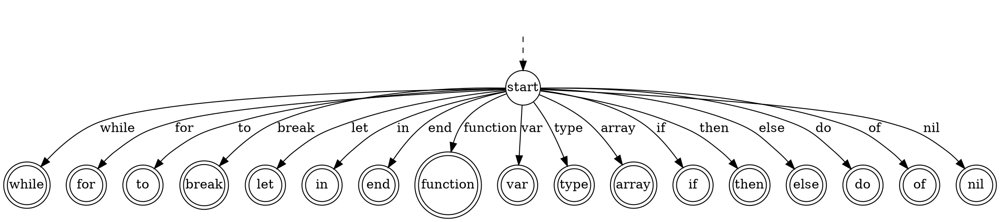
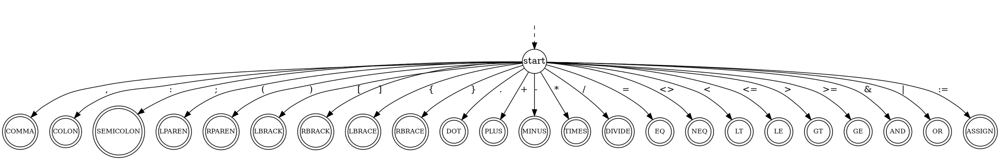
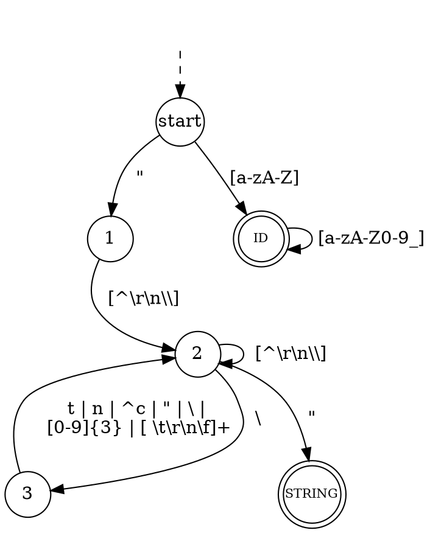

<!-- @import "[TOC]" {cmd="toc" depthFrom=1 depthTo=6 orderedList=false} -->

<!-- code_chunk_output -->

- [Flex使用手册 (kafm版)](#flex使用手册-kafm版)
    - [Flex简介](#flex简介)
    - [.lex 文件的组成](#lex-文件的组成)
      - [名字定义](#名字定义)
      - [规则定义](#规则定义)
      - [用户代码](#用户代码)
    - [Flex 的正则](#flex-的正则)
    - [匹配的具体过程](#匹配的具体过程)
    - [用户可用变量](#用户可用变量)

<!-- /code_chunk_output -->

# Flex使用手册 (kafm版)

<a href="http://dinosaur.compilertools.net/flex/index.html">Flex 2.5 manual, March 1995</a>

为使用`Flex`生成词法分析器而学习。

### Flex简介
`Flex`是同样伟大的`GNU`软件`lex`的现代版本，主要服务于`C/C++`语言。
同样存在如`JFlex`等服务于其他语言的版本。

`Flex`可以读入一个描述词法规则的文件（常以`.l`，`.ll`，`.lex`，`.l++`，`.fl`，`.flex`等作为后缀），输出一个对应的包含词法分析程序及其他有关部分的`C`语言源文件`lex.yy.c`。

### .lex 文件的组成
```lex
definitions
%%
rules
%%
user code
```
`.lex`文件通常由三部分组成，以符号`%%`隔开

#### 名字定义
`definitions`部分用来定义名字，即用名字代替某些正规式，以简化词法规则的编写。
定义名字的格式为`name definition`，如：
```
DIGIT    [0-9]
ID       [a-z][a-z0-9]*
```
可以在编写规则时使用，如
```
#识别一个浮点数
{DIGIT}+"."{DIGIT}*     { printf( "A float: %s (%g)\n", yytext, atof( yytext ) );}
```
当然，`{DIGIT}+"."{DIGIT}*`等价于`([0-9])+"."([0-9])*`

> 在名字定义部分，未缩进的注释/**/逐字输出到`lex.yy.c`中。

#### 规则定义
`rules`部分用来定义匹配规则，格式为`pattern   action`（`pattern`不可有缩进），
当识别出符合`pattern`的单词后，执行`action`，如
```
{DIGIT}+"."{DIGIT}*     { printf( "A float: %s (%g)\n", yytext, atof( yytext ) );}
```
识别出一个浮点数后，将它的字面值输出，并且以`%g`的格式打印该数值

> 在==名字定义或规则定义==部分，任何缩进的文本，或由`%{`与`%}`包括的部分将会直接输出到输出的`lex.yy.c`中。但`%{`与`%}`两行不可有缩进。
如，在上面的规则中，`atof()`函数要求包含`math.h`，可以在名字定义或规则定义部分，添加以下文本包含头文件。
```lex
%{
#include<math.h>
%}
```

> 在规则定义部分，第一条规则定义前的缩进或`%{}`文本都可用于声明扫描程序中的局部变量。声明语句后的代码在每次进入扫描程序时都会被执行。其他的缩进与`%{}`文本依然复制输出（但是这是一个没有明确定义的行为，为了符合`POSIX`标准而存在，可能会造成编译错误）。

#### 用户代码
`user code`部分用于用户自定义代码，作为例程的补充直接复制到输出的`lex.yy.c`中。
（实际输出位置在规则定义的的上方）
用户代码常用于编写一些由`action`调用或者调用`yylex()`的测试代码。
如在用户代码部分自实现`atof()`而不包含`math.h`，上面的例子仍然可以正常编译。

用户代码是可选的，即可以省略，当省略用户代码部分时，最后的分隔符`%%`也可以一同省略。

### Flex 的正则
Flex中的正则是正则表达式的超集（实际上不知道针对哪个标准的正则表达式而言）
以下摘录于`Flex 2.5 manual`
```
`x'
    match the character `x'

`.'
    any character (byte) except newline

`[xyz]'
    a "character class"; in this case, 
    the pattern matches either an `x', a `y', or a `z'

`[abj-oZ]'
    a "character class" with a range in it;
    matches an `a', a `b', any letter from `j' through `o', or a `Z'

`[^A-Z]'
    a "negated character class", i.e.,
    any character but those in the class.
    In this case, any character EXCEPT an uppercase letter.

`[^A-Z\n]'
    any character EXCEPT an uppercase letter or a newline

`r*'
    zero or more r's, where r is any regular expression

`r+'
    one or more r's

`r?'
    zero or one r's (that is, "an optional r")

`r{2,5}'
    anywhere from two to five r's

`r{2,}'
    two or more r's

`r{4}'
    exactly 4 r's

`{name}'
    the expansion of the "name" definition (see above)

`"[xyz]\"foo"'
    the literal string: `[xyz]"foo' (wrapped in "")

`\x'
    if x is an `a', `b', `f', `n', `r', `t', or `v',
    then the ANSI-C interpretation of \x.
    Otherwise, a literal `x' (used to escape operators such as `*')
    (escape character or escaped meta character / escape operators)

`\0'
    a NUL character (ASCII code 0)

`\123'
    the character with octal value 123

`\x2a'
    the character with hexadecimal value 2a

`(r)'
    match an r; parentheses are used to override precedence (see below)

`rs'
    the regular expression r followed by the regular expression s;
    called "concatenation" (串联)

`r|s'
    either an r or an s

`r/s'
    an r but only if it is followed by an s.
    The text matched by s is included when determining 
    whether this rule is the longest match,
    but is then returned to the input before the action is executed.
    So the action only sees the text matched by r. 
    This type of pattern is called trailing context. 
    (There are some combinations of `r/s' that flex cannot match correctly;
    see notes in the Deficiencies / Bugs section 
    below regarding "dangerous trailing context".)

`^r'
    an r, but only at the beginning of a line
    (i.e., which just starting to scan, or right after a newline has been scanned).

`r$'
    an r, but only at the end of a line (i.e., just before a newline).
    Equivalent to "r/\n".
    Note that flex's notion of "newline" is exactly 
    whatever the C compiler used to compile flex interprets '\n' as;
    in particular, on some DOS systems
    you must either filter out '\r's in the input yourself,
    or explicitly use r/\r\n for "r$".

`<s>r'
    an r, but only in start condition s (see below for discussion of start conditions)
    <s1,s2,s3>r same, but in any of start conditions s1, s2, or s3

`<*>r'
    an r in any start condition, even an exclusive one.

`<<EOF>>'
    an end-of-file <s1,s2><<EOF>> an end-of-file when in start condition s1 or s2
```
**关于`character class`**
> 在`character class`中，所有正规表达式元字符都失去特殊含义，除了`\`和`character class`本身的元字符`^`、`-`、`[`和`]`。

> 上面列出的正则表达式根据优先级进行分组的。如`foo|bar*`等价于`(foo)|(ba(r*))`

> `character class`还可以包括`character class expression`，
即一些预定义的表达式（且这些表达式必须出现在`[: :]`中）。
`[:alnum:] [:alpha:] [:blank:]`
`[:cntrl:] [:digit:] [:graph:]`
`[:lower:] [:print:] [:punct:]`
`[:space:] [:upper:] [:xdigit:]`
这些字符类表达式设计为与`标准C`中的`isXXX()`等价，如`isprint()`。
由于某些系统不支持`isblank()`，`Flex`将`[:blank:]`定义为`blank`或`tab`。
&emsp;
例如，以下的`character class`都是等价的
`[[:alnum:]]`
`[[:alpha:][:digit:]]`
`[[:alpha:]0-9]`
`[a-zA-Z0-9]`
&emsp;
如果无需大小写敏感，指定`-i`参数，`[:lower:][:upper:][:alpha:]`将等价

**Other Notes**
> 像`[^A-Z]`这样的字符类可以匹配换行符如`\n`，除非换行符也被显式地加入字符类。这一点与许多正则工具不一致，但是由于历史原因难以纠正。

>A rule can have at most one instance of trailing context (the `/` operator or the `$` operator).
The start condition, `^`, and `<<EOF>>` patterns can only occur at the beginning of a pattern, and,
as well as with `/` and `$`, cannot be grouped inside parentheses.
A `^` which does not occur at the beginning of a rule or a `$`
which does not occur at the end of a rule loses its special properties
and is treated as a normal character. The following are illegal:
`foo/bar$`
`<sc1>foo<sc2>bar`
Note that the first of these, can be written `foo/bar\n`. The following will result in `$` or `^` being treated as a normal character:
`foo|(bar$)`
`foo|^bar`
If what's wanted is a "foo" or a bar-followed-by-a-newline, the following could be used (the special `|` action is explained below):
`foo      |`
`bar\$     /* action goes here */`
A similar trick will work for matching a foo or a bar-at-the-beginning-of-a-line.

### 匹配的具体过程
- 若某段文本同时匹配多个规则，则选择可匹配最长文本的规则
若仍然有多个选择，按规则的先后顺序选择
（对于`r/s`或`$`等尾随上下文的规则，考虑尾随部分的长度，即使尾随部分会回退）
- 若无规则匹配，执行默认匹配规则，认为下一字符将会匹配并将当前字符返回

### 用户可用变量





