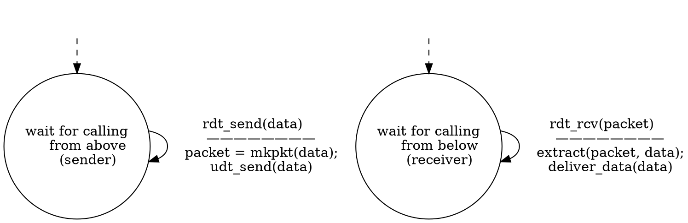
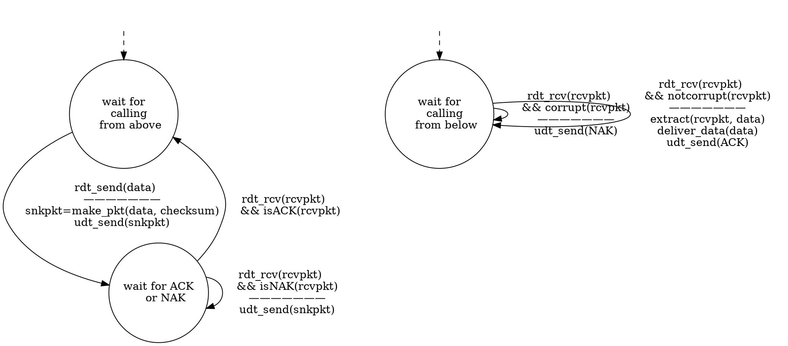

<!-- @import "[TOC]" {cmd="toc" depthFrom=1 depthTo=6 orderedList=false} -->

<!-- code_chunk_output -->

- [计算机网络：传输层](#计算机网络传输层)
  - [传输层概述](#传输层概述)
      - [传输层的基本理论和基本机制](#传输层的基本理论和基本机制)
      - [传输层服务概述](#传输层服务概述)
      - [Internet 的传输层协议](#internet-的传输层协议)
  - [多路复用和多路分用](#多路复用和多路分用)
  - [UDP (User Datagram Protocol)](#udp-user-datagram-protocol)
      - [UDP 的特点](#udp-的特点)
      - [UDP 的价值](#udp-的价值)
      - [UDP 段格式](#udp-段格式)
  - [可靠数据传输原理](#可靠数据传输原理)
      - [RDT 1.0](#rdt-10)
      - [RDT 2.0](#rdt-20)
      - [RDT 2.1](#rdt-21)
      - [RDT 2.2](#rdt-22)
      - [RDT 3.0](#rdt-30)
  - [滑动窗口协议](#滑动窗口协议)
      - [GBN Protocol，Go-Back-N Protocol](#gbn-protocolgo-back-n-protocol)

<!-- /code_chunk_output -->


# 计算机网络：传输层

## 传输层概述
#### 传输层的基本理论和基本机制
- 多路复用/分用
- 数据传输
- 流量控制
- 拥塞控制

#### 传输层服务概述
自下而上看，传输层是第一个端到端（end to end）层，为两个进程提供了一种逻辑通信机制。
在传输层，
- 发送方将应用层传递来的消息分成一个或多个`segment`，并向下传递给网络层
- 接收方将网络层提交的`segment`组装成消息，提交给应用层

#### Internet 的传输层协议
TCP：可靠、按序的交付服务
- 面向连接
- 拥塞控制
- 流量控制

UDP：不可靠的交付服务
基于尽力而为`(best-effort)`的网络层，不保证可靠传输

均不提供**延迟**及**带宽**方面的保障

## 多路复用和多路分用
对特定场景来说，协议是唯一的，而主机通常要为多个进程提供服务，
- 发送端多个`socket`共用传输层服务称为传输层服务的多路复用
（socket 处于应用层与传输层之间）
- 接收端传输层**根据`IP`地址和端口号**信息，将消息传递给正确的socket 接收，称为传输层服务的多路分用
（一台主机上可能有多个网络接口卡，网络适配器，即可拥有多个 IP 地址）

TCP 的多路分用中，socket 以四元组（源IP，源端口号，目的IP，目的端口号）来标识
（TCP 为每个客户建立一个连接，每个客户有独立的 socket）
（数据传递给 与发送数据的 socket 建立连接的另一个 socket）


UDP 的多路分用中，socket 以二元组（目的IP，目的端口号）来标识。
（不同源 IP 地址，不同源端口号的 IP数据包 交给同一个 socket）


**小结四问**：
什么是 / 为什么 / 怎么做 多路复用和多路分用？
Internet 中 TCP 和 UDP 是怎么做复用和多路分用的？

## UDP (User Datagram Protocol)
#### UDP 的特点
UDP ，用户数据报协议。是一个比较简单的协议，基于网络层 IP 协议仅实现了
- 复用/分用
- 简单的错误校验

相当于将 IP 层服务暴露给应用层

（在传输层进行错误校验基于以下几点原因：
1.无法保证下层链路进行了错误校验
2.传输层是接收数据的第一个端到端层，基于端到端原则，应对另一端发送的数据进行校验）

- best effort
UDP segment 可能丢失
可能非按序到达

- 无连接服务
无需建立连接
每个 UDP段 的处理独立于其他段

#### UDP 的价值
UDP 在 IP 的基础上实现，并未提供太多服务，因此 **UDP 的价值**主要在于：
- 无需建立连接(延迟小)；
- 实现简单；
- 头部开销小(8字节)；
- 无拥塞控制（应用层可以更好地控制发送速率和发送时间）

由于以上特点，UDP 适合用于流媒体应用（**容忍丢失**，**速率敏感**）
UDP 也用于 DNS，SNMP 等协议

此外，使用 UDP 的应用可以在应用层增加可靠性机制、或 特定的错误恢复机制

#### UDP 段格式
```ditaa {cmd=true args=["-E"] hide=true}
       32 bits width
+-------------+-------------+
|source port  |  dest port  |
+-------------+-------------+
|   length    |   checksum  |
+-------------+-------------+
|                           |
|                           |
|    application data       |
|                           |
|                           |
+---------------------------+
      UDP segment format
```
如图所见，UDP 头部有四个字段，各占 2 个字节，共占 8 字节。
四个字段依次为**源端口号**、**目的端口号**、**段长度**（包括头部），和**校验和**。

**校验和**：
- 发送方将段的内容视为 16-bit 的整数，校验和字段视为 全0，计算所有整数的和，进位加在和的后面
将得到的值按位求反，得到校验和，放入校验和字段
- 接收方计算收到段的校验和，与校验和字段相比对
若不一致，则传输中出错
若一致，不能保证未出错
（实际上，由于二进制的特殊性，在校验过程中接收方只需将所有整数求和，
包括校验和字段，得到的结果为 全1 即校验成功。(原结果取反置为校验和，
则填充校验和后的段再次计算，相当于未填充校验和的计算结果加上该结果取反，即 全1)）

## 可靠数据传输原理
可靠数据传输（RDT，reliable data transfer）目的：在不可靠的信道上进行可靠的数据传输
什么是可靠？
不错（数据正确），不丢（确认机制、滑动窗口），不乱（识别分组顺序）

上图中单向箭头表示简单的调用关系，如应用层调用`rdt_send()`向传输层发送数据
双向箭头表示双方之间并非简单的单向数据流动，还有双向的控制消息的传递

**下面通过讨论不同可靠程度信道上的可靠传输协议的设计来理解可靠传输原理**

#### RDT 1.0
假设底层信道完全可靠（不会发生错误，不会丢弃分组）
则可靠传输协议的状态图表示如下


#### RDT 2.0
假设底层信道仅可能产生位错误（不会丢弃分组）
发现错误：通过校验和检验
处理错误：当发送方得知分组传输错误时重发相应分组
①增加确认机制/控制消息(Acknowledgements，ACK)：显式地告知发送方分组已正确接收
②NAK：显式地告知发送方分组有误

基于这种重传机制的 RDT协议 称为==ARQ（Automatic Repeat reQuest）协议==
引入的新机制：差错检测、接收方反馈控制消息（ACK/NAK）、重传

若采用 ACK + NAK 机制，发送方发送一个消息后等待接收方的响应，
收到响应后判断重发当前消息还是发送下一条消息，发送消息后进入一种停止-等待的状态
则这种停-等（stop-and-wait）协议的状态图表示如下


#### RDT 2.1
停-等协议的缺陷及应对策略：
- ACK / NAK 在传输过程中可能出错
①为 ACK / NAK 增加检错及纠错机制
②增加额外的控制消息，然而控制消息也可能出错
- 若 ACK / NAK 出错，发送方直接重传
引入序列号机制避免重复分组，接收方根据分组的序列号丢弃重复分组

```dot {engine="dot"}
digraph RDT_2_1 {
    overlap=false;
    splines=true
    graph [dpi=60]
    node [shape="circle" margin="0"]; S0,W0,S1,W1;
    
    S0[label="wait for
    calling 0
    from above" fontsize="14"];

    W0[label="wait for ACK
    or NAK 0" fontsize="14"];

    S1[label="wait for
    calling 1
    from above" fontsize="14"];

    W1[label="wait for ACK
    or NAK 1" fontsize="14"];

    S0 -> W0 [label="rdt_send(data)
    ———————
    snkpkt=make_pkt(0, data, checksum)
    udt_send(snkpkt)"]

    W0 -> S1 [label="rdt_rcv(rcvpkt)
    && notcorrupt(rcvpkt)
    && isACK(rcvpkt)"]

    S1 -> W1 [label="rdt_send(data)
    ———————
    snkpkt=make_pkt(1, data, checksum)
    udt_send(snkpkt)"]

    W1 -> S0 [label="rdt_rcv(rcvpkt)
    && notcorrupt(rcvpkt)
    && isACK(rcvpkt)"]

    W0 -> W0 [label="rdt_rcv(rcvpkt)
    && (corrupt(rcvpkt)
    || isNAK(rcvpkt))
    ———————
    udt_send(snkpkt)"]

    W1 -> W1 [label="rdt_rcv(rcvpkt)
    && (corrupt(rcvpkt)
    || isNAK(rcvpkt))
    ———————
    udt_send(snkpkt)"]

    N [style="invis"]
    N -> S0 [style="dashed"]
    
}
<!-- 我决定以后画文本复杂的状态机图不再用这种sb玩意了 -->
```

```

```

#### RDT 2.2
使用`ACK`携带确认序列号来代替`NAK`
接收方每次收到分组，就返回携带已确认的分组序号的`ACK`

```dot engine={"dot"}

```

#### RDT 3.0
假设信道既可能出现错误，也可能丢失分组
显然，RDT 2.x 无法正常工作，分组丢失后，发送方与接收方都会陷入无限等待的状态
发送方等待确认，接收方等待分组才能发送确认，形成一种“死锁”局面

这种情况下，需要一种方式打破这个局面：发送方主动发送分组
即，在**合理**的时间内（引入计时器），发送方若未收到 ACK，重传（**超时重传**）。

同样，使用序列号机制处理重复分组。

```dot engine={"dot"}

```

RDT 3.0 虽然可以正常工作，仍然是一种停-等协议，性能很差。

如上图所示流程，假设链路带宽 R = 1Gbps，端到端传输时延 15 ms，分组大小 L = 1KB
则发送时延为 T~transmit~ = L / R = 8KB / 10^9^ bps = 8 ms
发送方信道利用率为 U~sender~ = T~transmit~ / (RTT + T~transmit~) ≈ 0.00027 （忽略 ACK 发送时延）
发送方每 30ms 发送一个分组，1Gbps 的链路最终速率为 33KB/s

**网络协议限制了物理资源的利用**

## 滑动窗口协议
不难理解，RDT 3.0 的性能局限基本上是由于停-等机制，使数据的发送时延扩大为 RTT

在上一幅时空图中，明显可以看出信道有很大闲置（白色区域）
可以采用**流水线机制**扩大信道的利用率

停-等协议与流水线协议的对比：


基于流水线的协议：允许发送方在收到 ACK 前，连续发送多个分组
- 更大的序列号范围
- 发送方及接收方需要更大的存储空间以缓存分组

滑动窗口示意图

&emsp;&emsp;&emsp;&emsp;&emsp;滑动窗口示意图
窗口：允许使用的序列号范围，窗口尺寸为 N，最多有 N 个等待确认的消息

#### GBN Protocol，Go-Back-N Protocol

